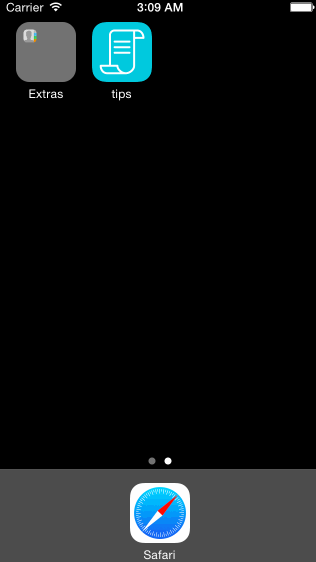

# codepath-tipcalculator

This is a simple Tip Calculator application developed in Swift for iOS. The core of the app was developed by following careful step-by-step instructions in a [video walkthrough](https://vimeo.com/102084767) by Tim Lee from Code Path.

Time spent: 4.25 hours spent in total

Completed user stories:

 * [x] Required: User can input bill amount and view a tip calculation (based on 3 percentages) and total amount
 * [x] Optional: User can select the number of people (between 1 and 6) to get a per-person total
 
Notes:

Spent some time on optional tasks like customizing color, typeface, app icon, launch image, and animations.

Walkthrough of all user stories:

GIF created with [LiceCap](http://www.cockos.com/licecap/).
